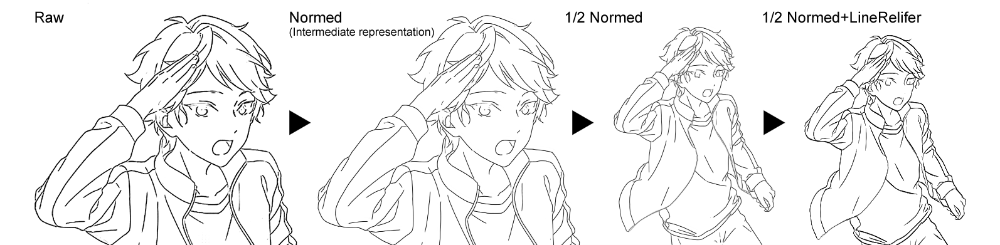

# LineNormalizer

 

## Overview
Normalize rasterization line-drawings to uniform width using deep learning with model from [Smart Inker](http://hi.cs.waseda.ac.jp/~esimo/en/research/inking/).

This model can serve as line-drawings preprocessor for [LineRelifer](https://github.com/hepesu/LineRelifer/). Line-drawings can be normlized to an intermediate representation and then be used as training data or input for it.
Also by using this method, we can achieve uniform line width during scaling up or down the rasterization line-drawings, which is a feature of vector line-drawings. The train data is generated by code, so you can get model for any width easily.

## Dependencies
* Keras2 (Tensorflow backend)
* OpenCV3
* CairoSVG

## Usage
1. Set up directories.

2. Download the model from release and put it in the same folder with code.

3. Run `predict.py` for prediction. Run `model{NUM}.py` for train.

## Models
Models are licensed under a CC-BY-NC-SA 4.0 international license.

From **Project HAT** by Hepesu With :heart:
